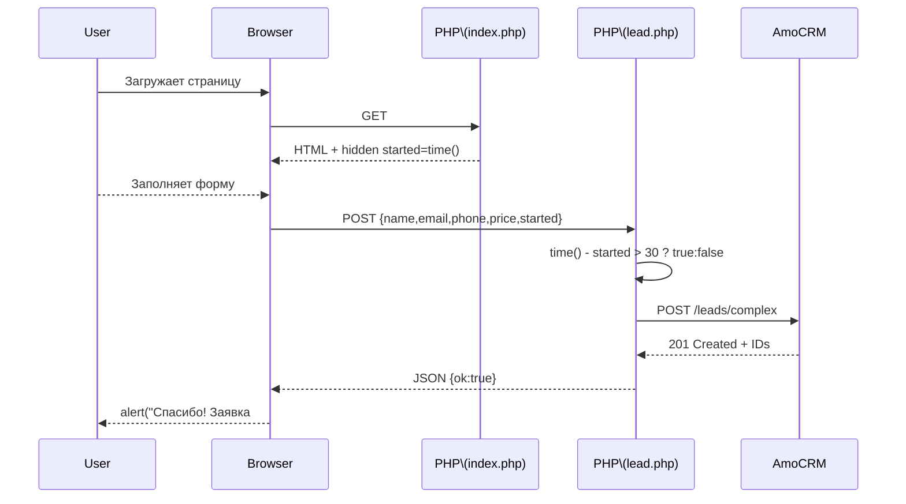

# AmoSendler ⏱️ → 💼

> **Лёгкая PHP‑форма, которая в один клик создаёт сделку и контакт в AmoCRM (Kommo)**
> и автоматически помечает, был ли посетитель на лендинге дольше 30 секунд.

---

## ✨ Почему это удобно

|  Фича                     |  Что получает маркетолог                                      |
| ------------------------- | ------------------------------------------------------------- |
| **Zero JS‑таймер**        | Время пребывания вычисляется на PHP, фронт остаётся “чистым”  |
| **API v4 одним запросом** | `/leads/complex` → сразу сделка **и** контакт                 |
| **Чек‑бокс “> 30 сек”**   | Моментально видно, собирал ли лид контент на странице         |
| **Без перезагрузки**      | Простые `alert()` на успех / ошибку — UX не ломается          |
| **Чистый PHP 7.4+**       | Работает даже на самом бюджетном shared‑хостинге              |

---

## 📂 Структура

```text
/public_html/
└─ AmoSendler/
   ├─ index.php      # страница‑форма (HTML + минимальный JS)
   ├─ lead.php       # серверный обработчик, общается с AmoCRM
   └─ style.css      # опциональные стили (подключите свои)
```

---

## ⚙️ Требования

* **PHP 7.4+** c включённым расширением `curl`
* Хостинг (shared / VPS) с HTTPS‑доменом
* Аккаунт **AmoCRM** с доступом «Администратор»

---

## 🚀 Установка за 5 шагов

1. **Клонируйте** репозиторий в папку сайта.
2. В AmoCRM создайте **Внешнюю интеграцию** → сохраните `client_id`, `client_secret`, получите `authorization_code` → обменяйте на `access_token` / `refresh_token`.
3. В карточке **Сделки** добавьте чек‑бокс‑поле «На сайте > 30 сек» и запомните его **ID** (например `338991`).
4. Откройте `lead.php`, заполните константы:

   ```php
   const SUBDOMAIN     = 'mycompany';   // без .amocrm.ru
   const ACCESS_TOKEN  = '•••';
   const REFRESH_TOKEN = '•••';
   const TIME_FIELD_ID = 338991;        // ID чек‑бокса
   ```
5. Загрузите файлы, откройте `index.php` — тестовая заявка должна появиться в CRM.

---

## 🗺️ Как это работает



---

## 🧑‍💻 Использование

| Действие                    | Результат в CRM                          |
| --------------------------- | ---------------------------------------- |
| Отправить форму молниеносно | Поле‑флаг — `false` / *галочка не стоит* |
| Подержать страницу 30 сек   | Поле‑флаг — `true` / *галочка стоит*     |

---

## 🔐 Безопасность & Dev notes

* Храните токены **вне репозитория** (например, в `.env` и прокидывайте через `putenv()`).
* Не заливайте файл `access_token.tmp` в Git.
* Защитите каталог `/AmoSendler/` через `.htaccess`, если не хотите, чтобы `lead.php` был публичен.
* В combat‑режиме замените `alert()` на модальное окно или кастомный Toast.

---

## 📝 Лицензия

© 2025 — Сделано с ♥ от JQuBiiK. Fork, звезда и PR‑ы приветствуются!
